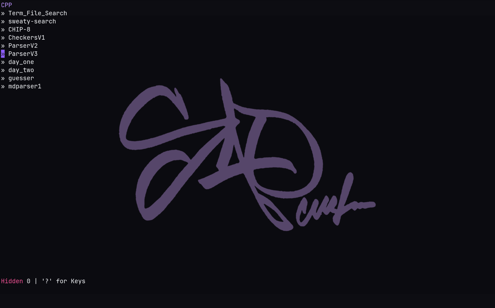
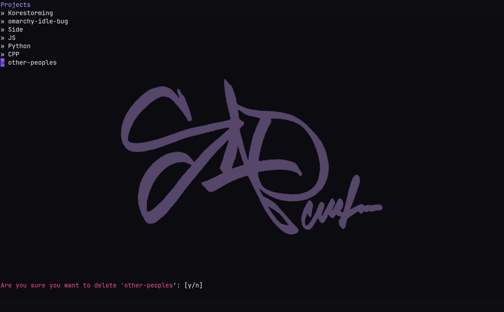
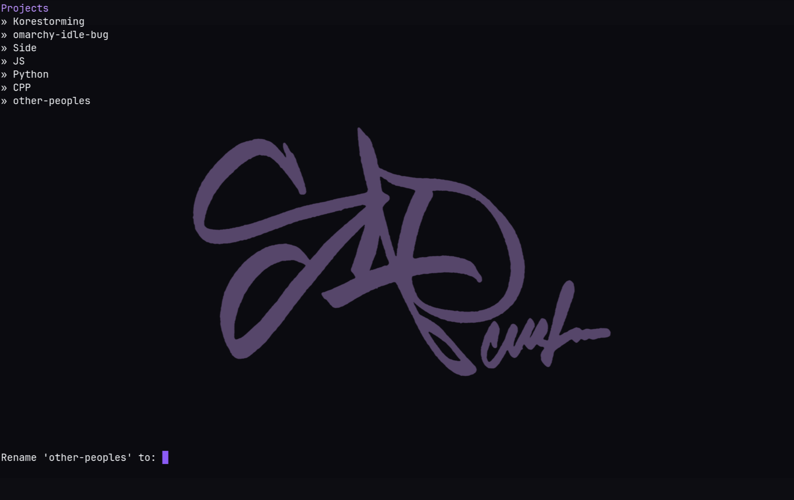
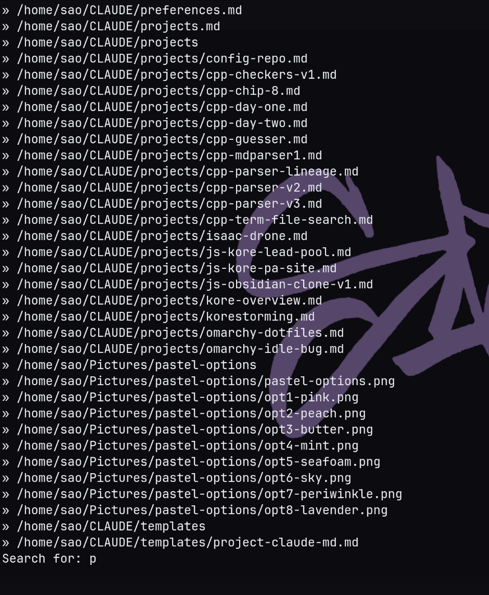
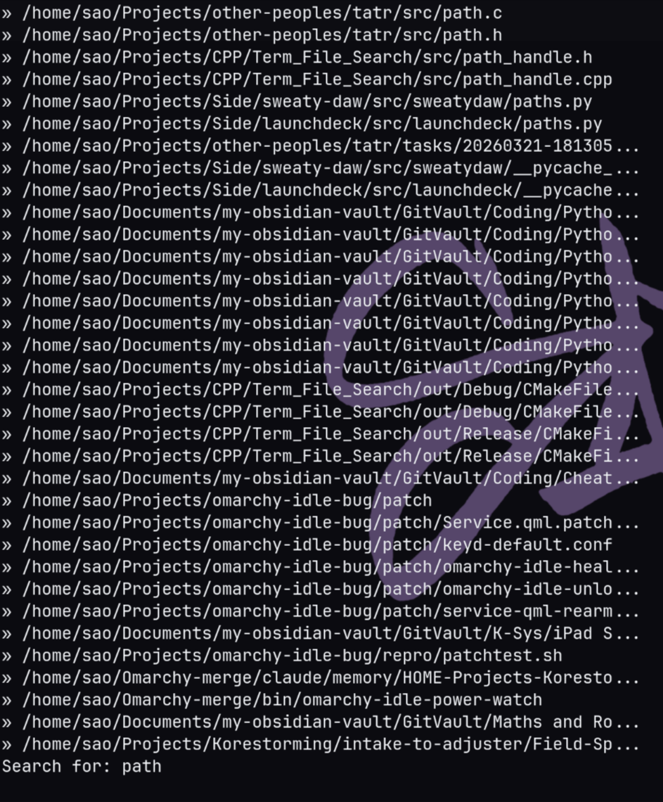
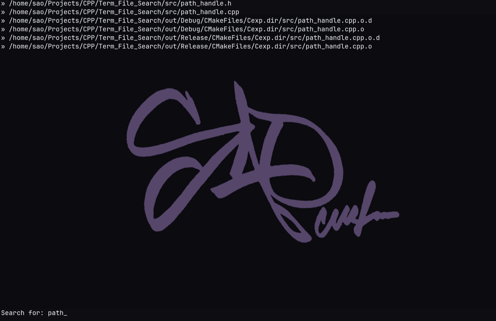
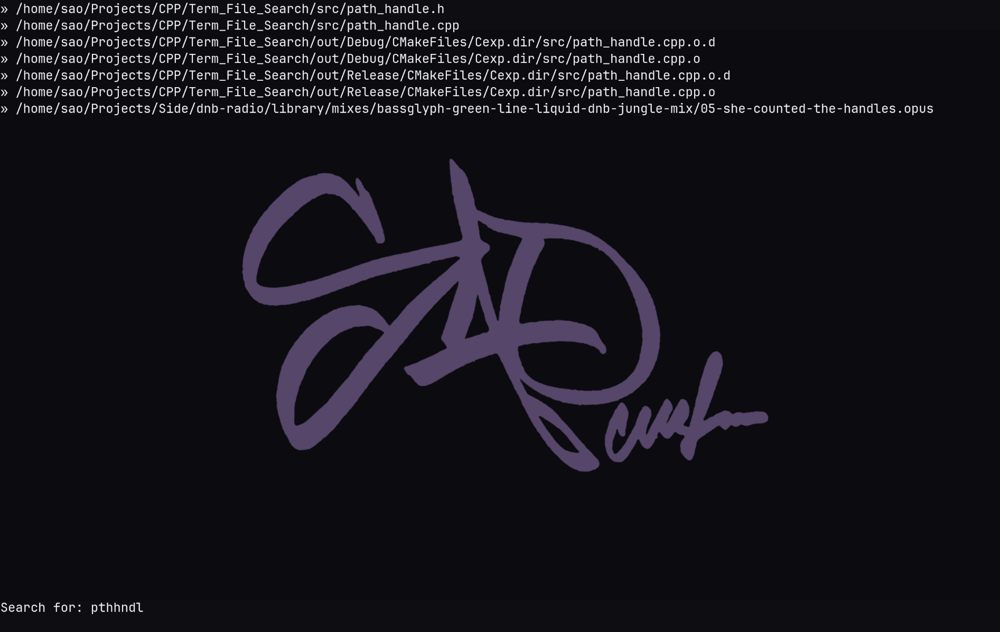

# Sweaty-Terminal-Browser

This was the first real project I had planned when I felt I had my bearings in basic C++. Written entirely by my own two hands and I would like to keep it away from AI for a while. I used AI for consulting on certain syntax I don't know but it never edited a file in this repo and should remain that way.
This project was meant to be a real usable project that I could be proud to present to others, and I think I achieved that. I hope more people find the use in this project. Especially those that are newer to traversing the terminal.


# Preview










# Design choices 

- While creating this I wanted this tool to be intuitive to use coming from nvim and similar movement systems. That is why the movement resembles the vim key binds. 
- The entire tool is made and renders entirely without using any external terminal drawing libraries. It uses "termios" for the setting up of raw mode and the handing of the key inputs. The rest is straight writing to the buffer and moving the cursor by hand and clearing it by hand.
- The "Search" function is built off of my own "Fuzzy Search" that I attempted to write myself. It works based of finding a substring and subsequence and ranks them separately depending on which it is. This allows for the partial missing of letters but still able to find the desired file. ==Look at Search Mode - 4== I still plan on writing more proper search with gap and match measurements and hope that can be more polished than the search I have now.
- The "Search" currently does an initial load of the entire ==$HOME== directory and recursively walks all children folders. This creates an array that holds all the paths to every single file. The thinking behind this was entirely to "optimize" the speed at which the search happens. In the future I will make this a background process that happens upon opening the tool and then the user will either be hit with a loading entries message or able to jump into search depending on the size.
- Started as raw terminal writing and then moved to a more state based system that runs off key inputs that set a state and then refresh the screen based on the state. This is going to be refined in the future and will likely be some kind of streaming for parts. In the distant future I hope to make my own diff terminal rendering system to only render what has changed. But for now this is just a state is set by keys and then refresh screen and wait for keys. With a couple flags like ==search-selector== and ==hidden==


## Build

Requires CMake and a C++17 compiler (for `std::filesystem`).

```bash
git clone https://github.com/Steven-ODell/Sweaty-Terminal-Browser.git
cd Sweaty-Terminal-Browser
cmake -S . -B out/Release -DCMAKE_BUILD_TYPE=Release
cmake --build out/Release -j
./out/Release/Cexp
```

Build as Release. The search walks every path under `$HOME`, and an unoptimized
build is noticeably slower.

Takes an optional path argument to open into a starting folder (relative to current folder):

```bash
./out/Release/Cexp /Documents
```

To run it from anywhere, copy the binary onto your `PATH`:

```bash
cp out/Release/Cexp ~/.local/bin/
```


## Keybindings

### Browser

| Key | Action |
|---|---|
| `j` / `k` | Move down / up |
| `l` / `o` / `Enter` | Open folder or file |
| `h` / `Backspace` | Go to parent folder |
| `a` | New folder (nested paths like `docs/notes` work) |
| `r` | Rename selected entry |
| `d` | Delete selected entry (asks to confirm, deletes recursively) |
| `H` | Toggle hidden files |
| `s` | Search |
| `?` | Show keybindings |
| `q` / `Q` / `Esc` | Quit |

### Search

While typing:

| Key | Action |
|---|---|
| Any key | Add to query |
| `Backspace` | Delete a character |
| `Enter` | Jump to results |
| `Esc` | Cancel, back to browser |
| `?` | Show keybindings |

While picking a result:

| Key | Action |
|---|---|
| `j` / `k` | Move down / up |
| `Enter` | Open result |
| `i` / `Esc` | Back to typing |

### Rename / New folder

| Key | Action |
|---|---|
| Any key | Type name |
| `Backspace` | Delete a character |
| `Enter` | Confirm |
| `Esc` | Cancel |

### Delete confirmation

| Key | Action |
|---|---|
| `y` / `Y` | Delete |
| `n` / `N` / `Esc` | Cancel |


# Limitations

I am well aware of many limitations within the project currently. Small list of the bugs currently:
```markdown
- No window resize handling
- Flicker. Reduced, not fixed
- Preview is a stub
- No tests implemented
- Only one argument is read, with no flag parsing
- cur_row and cx are fighting eachother
- Null check on `getenv("HOME")`. Assigning `nullptr` to a `std::string` is
  undefined; flag it when `HOME` isn't set.
- Clean up code in general 
- Arrow keys are taken as "esc" or "\x1b"
```
just to name a few. Many more are listed in the ==tasks== folder and the ==plans.md==
